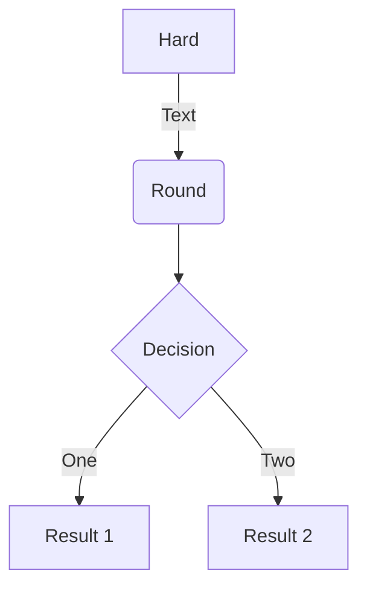

# mermaid.js

```object
{
  "a": 1
}
```

### Flowcharts: 流程图

由节点、几何形状和边、箭头或线条组成



### object

```object
{
  "id": "Modeling Methods",
  "children": [
      {
          "id": "Classification",
          "children": [
              {
                  "id": "Logistic regression"
              },
              {
                  "id": "Linear discriminant analysis"
              },
              {
                  "id": "Rules"
              },
              {
                  "id": "Decision trees"
              },
              {
                  "id": "Naive Bayes"
              },
              {
                  "id": "K nearest neighbor"
              },
              {
                  "id": "Probabilistic neural network"
              },
              {
                  "id": "Support vector machine"
              }
          ]
      },
      {
          "id": "Consensus",
          "children": [
              {
                  "id": "Models diversity",
                  "children": [
                      {
                          "id": "Different initializations"
                      },
                      {
                          "id": "Different parameter choices"
                      },
                      {
                          "id": "Different architectures"
                      },
                      {
                          "id": "Different modeling methods"
                      },
                      {
                          "id": "Different training sets"
                      },
                      {
                          "id": "Different feature sets"
                      }
                  ]
              },
              {
                  "id": "Methods",
                  "children": [
                      {
                          "id": "Classifier selection"
                      },
                      {
                          "id": "Classifier fusion"
                      }
                  ]
              },
              {
                  "id": "Common",
                  "children": [
                      {
                          "id": "Bagging"
                      },
                      {
                          "id": "Boosting"
                      },
                      {
                          "id": "AdaBoost"
                      }
                  ]
              }
          ]
      },
      {
          "id": "Regression",
          "children": [
              {
                  "id": "Multiple linear regression"
              },
              {
                  "id": "Partial least squares"
              },
              {
                  "id": "Multi-layer feedforward neural network"
              },
              {
                  "id": "General regression neural network"
              },
              {
                  "id": "Support vector regression"
              }
          ]
      }
  ]
}
```